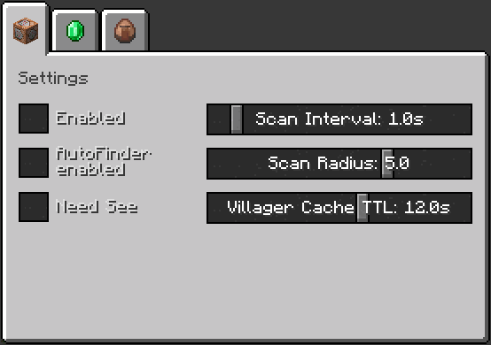

# AutoVillagerTrader

A client-side Fabric mod that allows fast and automatic trading with villagers based on configurable trades

You can easily set up your preferred trades in a simple, vanilla-like configuration screen
and customize keybinds to start or stop the trading process.
When activated, the mod automatically finds nearby villagers
and performs all available trades defined in your config - no more endless clicking!

### Disclaimer

This mod is intended for personal use only.
I do not endorse or encourage the use of cheats or exploits in any form.
By using this mod, you are solely responsible for any consequences that may arise.
I do not take any responsibility for any issues, bans, or punishments that may result from using this mod.

Before using this mod on any multiplayer server, please check with the server's administration to ensure that the use of such modifications is allowed.
Many servers prohibit the use of mods that can affect gameplay or give players an unfair advantage.
It is your responsibility to ensure that you are not violating any server rules.

Use at your own risk.
